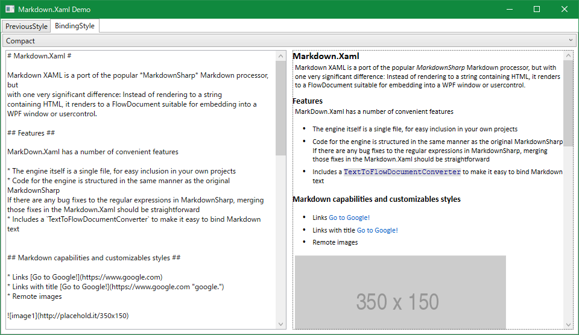
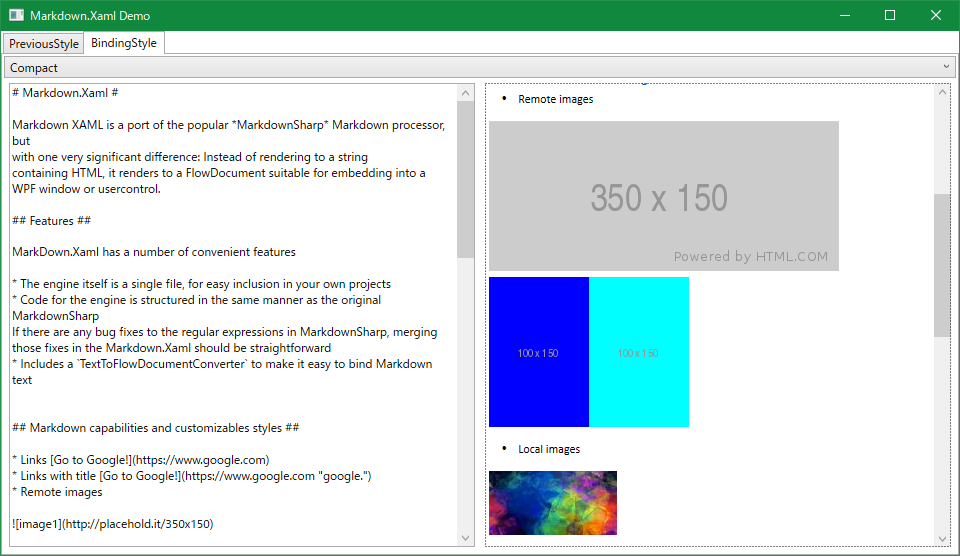
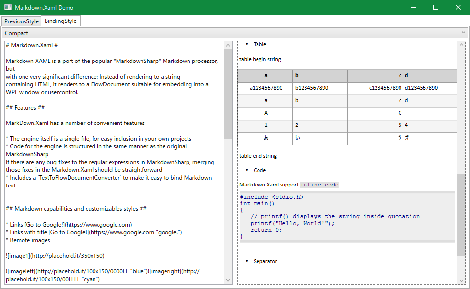

# Markdown XAML

Markdown XAML is a port of the popular 
[MarkdownSharp](http://code.google.com/p/markdownsharp/) Markdown processor, but with one very 
significant difference: Instead of rendering to a string containing HTML, it renders to a 
[FlowDocument](http://msdn.microsoft.com/en-us/library/system.windows.documents.flowdocument.aspx) 
suitable for embedding into a WPF window or usercontrol.

With HTML output, details of fonts and colours (and so on) are handled by CSS, but with a 
FlowDocument there's no direct equivalent. Instead of the HTML approch of linking a 
stylesheet to the rendered output, MarkDown.Xaml uses WPF styles that are linked to
the rendering engine and applied to the output as it is generated. See the *included demo* 
application for an example of how this can be configured.

## Where would I use this?

I wrote this to use in a WPF application where I was generating paragraphs of text for that 
described the output of a rules engine, and I wanted a richer display than just a column of plain 
text.

Potentially, I could have used MarkdownSharp and an embeded browser or other HTML renderer to 
achieve this (the route taken by [MarkPad](http://code52.org/DownmarkerWPF/), but this didn't 
give me the fine control over appearance that I desired.

## Samples

Try Markdown.Xaml.Demo for another markdown and style.

## Where shouldn't I use this?

If the Markdown you are processing is going to end up translated to HTML, stick with 
MarkdownSharp or one of the other similar translators, so that your rendering is as accurate as 
possible. On the otherhand, if you are showing the Markdown within your WPF application and not
passing it out to a browser elsewhere, Markdown XAML may be a great fit.

## What differences are there?

Since the output is not HTML, any embedded HTML is going to end up displayed as raw code. This 
also means that there's no way to bypass (or tunnel through) the Markdown engine to achieve 
anything not supported by Markdown directly. Depending on your context this may or may not be a
significant issue.

## What remains to be done?

The core of the Markdown render is complete, as is support for basic styling. The structure of the 
MarkdownSharp codebase has been retained to aid maintenance - if there are any regular expression 
fixes there, they should be easy to patch in here.

There are a number of Markdown extensions that could be supported, though since MarkdownSharp 
targets only the core, this would necessitate a departure from keeping the codebase as similar as
possible.

## License

Markdown XAML is licensed under the MIT license.